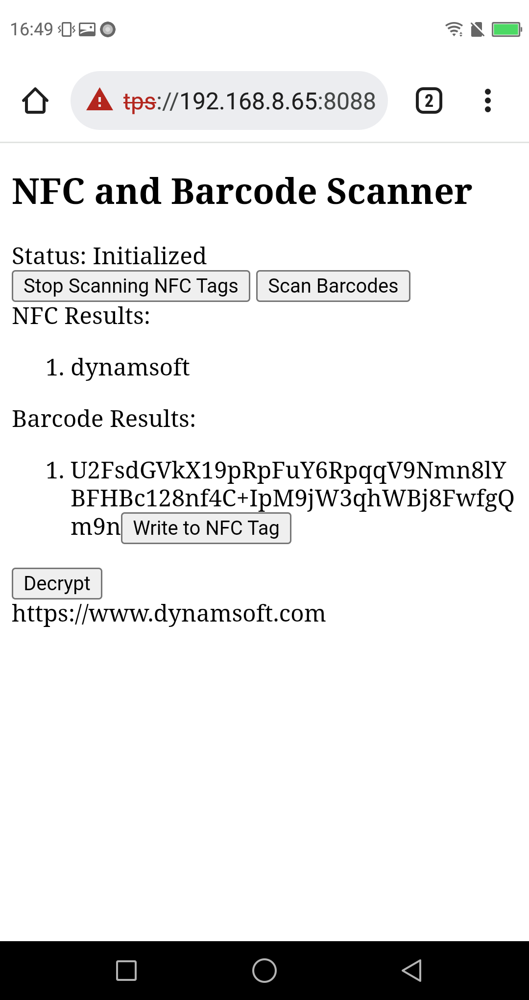
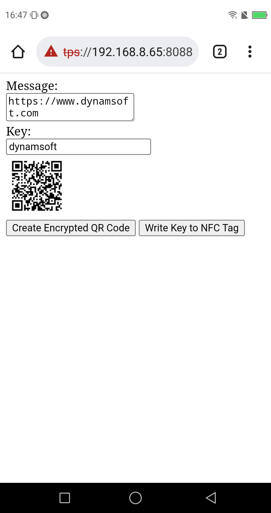

# NFC-Barcode-Scanner

A web app which scans both NFC tags and barcodes.

* [index.html](https://tony-xlh.github.io/NFC-Barcode-Scanner/): It can scan NFC tags and barcodes. It can also write the barcode result into an NFC tag and decrypt the barcode content with the key stored in an NFC tag using AES.
* [generator.html](https://tony-xlh.github.io/NFC-Barcode-Scanner/generator.html): It can generate an encrypted QR code using AES.

[Dynamsoft Barcode Reader](https://www.dynamsoft.com/barcode-reader/overview/) is used to scan barcodes.

Index:

Generator:

